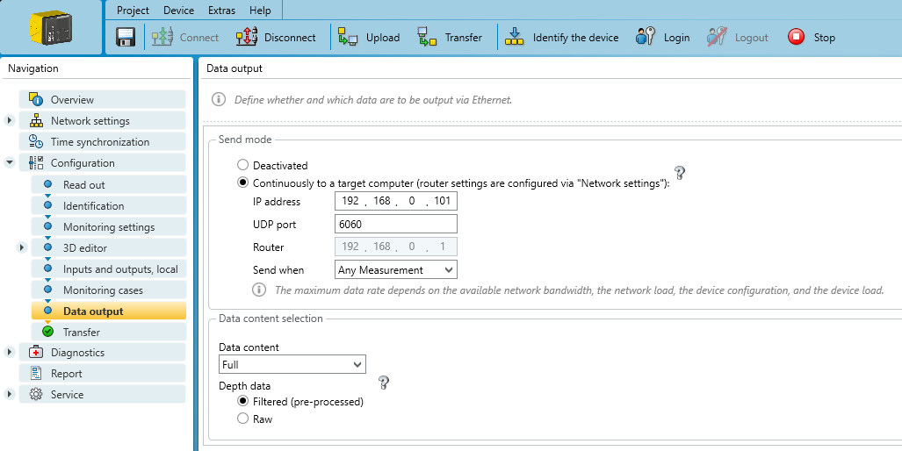

# Safety designer

The Sick *safeVisionary2* camera uses a UDP-based communication to stream sensor data to a single receiver (*target computer*).
This receiver needs to be in the same subnet as the camera and is uniquely identified by an IP address and a port.

The image below depicts an exemplary setup for a *target computer* at `192.168.0.101` on port `6060`.

