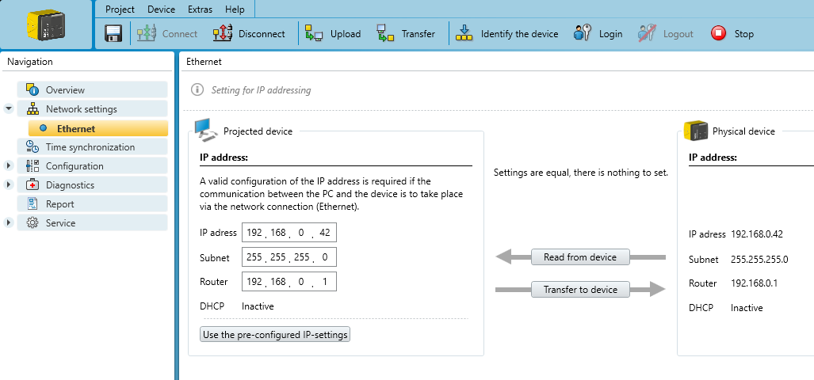

# Safety designer

The Sick *safeVisionary2* camera uses a UDP-based communication to stream sensor data to a single receiver (*target computer*).
This receiver needs to be in the same subnet as the camera and is uniquely identified by an IP address and a port.

## Install SICK Safety Designer
To use the camera it is required to initially set up the network and transfer settings using the SICK Safety Designer software.
The software is available [here](https://www.sick.com/us/en/safety-controllers/safety-controllers/safety-designer/c/g575306) and requires a Windows machine connected to the sensor.

## Configure the Sensor Network
First, the IP address of the sensor has to be configured to the used network, as can be seen below.
In this case the exemplary network is `192.168.0.0/24`, in which the sensor has the `192.168.0.42` IP address.

## Configure the UDP Connection
Afterwards, the UDP connection to the *target computer* has to be configured.
This includes the *target computer* IP and port setup as well as an additional flag which specifies whether data is transferred in the first place.

The image below depicts an exemplary setup for a *target computer* at `192.168.0.101` on port `6060`.
Make also sure to configure *send when* to *Any Measurement* to let the sensor publish data over UDP.

## Synchronize the Sensor Configuration

To finalize the setup, the configuration has to be transferred to the sensor in the `Transfer` tab of the Safety Designer.

